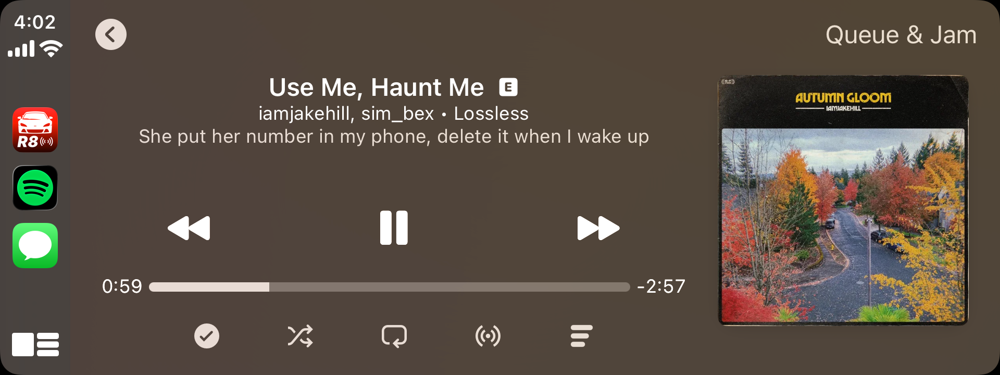
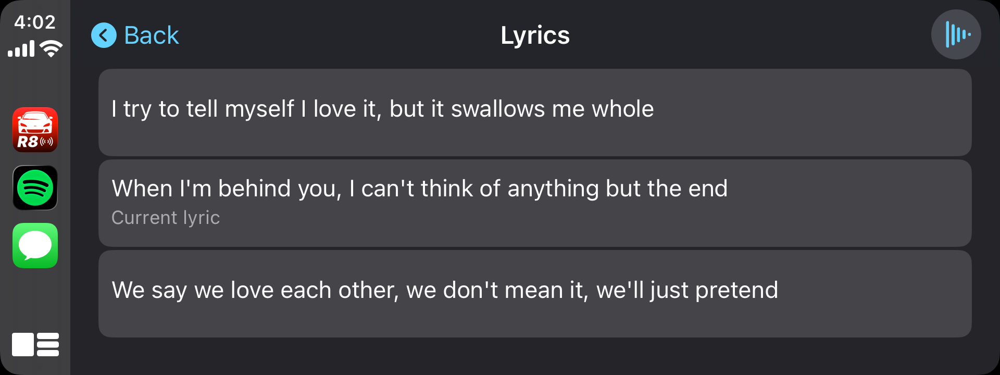
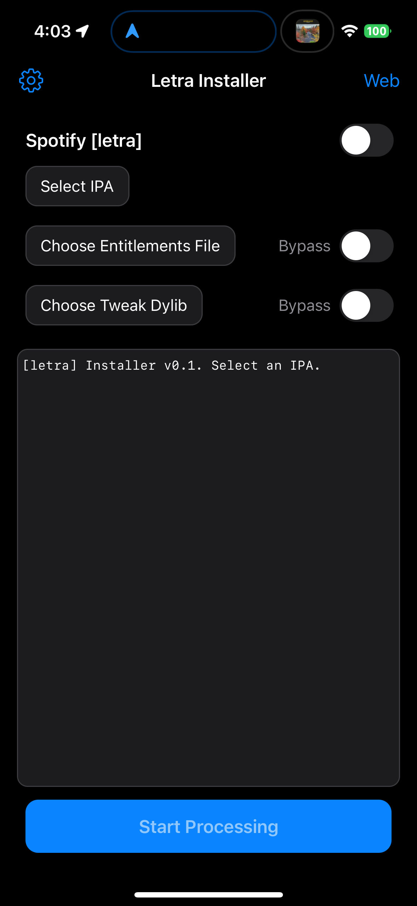

# Letra

Letra is a sideloaded Spotify tweak that adds synchronized lyrics to Spotify's CarPlay experience. It reads Spotify's lyric data and playback position, presents the current lyric in a CarPlay lyrics view, and can optionally mirror the active lyric in the CarPlay now-playing album field.

## Components

### Letra tweak

The tweak is injected into a decrypted Spotify IPA. Its main features are:

- A CarPlay lyrics button and lyrics view.
- Timestamp-aware lyric selection tied to Spotify's playback position.
- Handling for song changes, seeking, pauses, unavailable lyrics, and stale lyric responses.
- Optional timing offset support for CarPlay systems whose display runs slightly early or late.
- Optional now-playing album-text integration for showing the current lyric on the stock now-playing screen.
- Optional runtime diagnostics for investigating Spotify and CarPlay behavior during development.

#### CarPlay screenshots

  
  

### Letra Installer

Letra Installer is a companion TrollStore utility for preparing an authorized IPA. It can:

- Select an IPA, tweak dylib, and entitlements file through the Files app.
- Inspect the IPA's bundle metadata before processing.
- Inject a dylib into the app executable with the bundled Mach-O/ChOma tooling.
- Sign the modified bundle with ldid, using supplied entitlements or preserving the IPA's embedded entitlements.
- Save the finished IPA with a descriptive filename or hand it off to TrollStore for installation.
- Download source files through its built-in browser and export them to Files.

The installer does not provide an app binary or bypass authorization. The user must supply an authorized decrypted IPA and any tweak or entitlement files they have permission to use.

#### Installer screenshot

  

## Disclaimer

This project is provided for educational, interoperability, and personal research purposes. Spotify, CarPlay, TrollStore, and Apple are trademarks of their respective owners. Do not redistribute modified proprietary applications or use this project to circumvent access controls or licensing restrictions.
